# 🚀 RIFT Healing Agent - Autonomous DevOps AI

An intelligent multi-agent system that automatically detects, fixes, and verifies code errors in CI/CD pipelines. Built for **RIFT 2026 Hackathon** — AI/ML · DevOps Automation · Agentic Systems Track.

> **🌐 Live Demo**: [Coming Soon — Deploying to Render]  
> **🎥 Video Demo**: [Coming Soon — LinkedIn Video]

---

## 🎯 Features

- **Autonomous Error Detection**: Discovers and runs all test files automatically
- **Intelligent Fixing**: Uses GPT-4o / Groq to generate targeted fixes for failures
- **CI/CD Integration**: Monitors pipeline and iterates until all tests pass (up to 5 retries)
- **Multi-Language Support**: Python, JavaScript, TypeScript, Java, Go, Rust
- **GitHub OAuth Login**: Secure authentication — no manual token setup
- **Production Dashboard**: Real-time React dashboard with score breakdown, fix tracking, and pipeline visualization

---

## 🏗️ Architecture

### System Architecture Diagram

```mermaid
graph TB
    subgraph Frontend["🖥️ React Frontend (Vite)"]
        LP[Login Page<br/>GitHub OAuth]
        DB[Dashboard<br/>Stats & History]
        RP[Run Page<br/>Repo Input Form]
        RS[Results Page<br/>Live Pipeline View]
    end

    subgraph Backend["⚙️ FastAPI Backend"]
        API[REST API + SSE]
        AUTH[OAuth Handler]
        ORC[LangGraph Orchestrator]
    end

    subgraph Pipeline["🤖 Multi-Agent Pipeline"]
        C[Clone Agent] --> T[Test Agent]
        T --> A[Analyze Agent]
        A --> F[Fix Agent<br/>GPT-4o / Groq]
        F --> V[Verify Agent]
        V -->|Tests Fail| A
        V -->|Tests Pass| P[Push Agent]
    end

    subgraph Storage["💾 Storage"]
        SQLite[(SQLite DB<br/>Users, Runs, Fixes)]
        FS[File System<br/>Cloned Repos]
    end

    LP -->|OAuth Code| AUTH
    AUTH -->|Token| API
    RP -->|POST /api/run-agent| API
    RS -->|SSE /api/stream| API
    DB -->|GET /api/stats| API
    API --> ORC
    ORC --> Pipeline
    Pipeline --> SQLite
    Pipeline --> FS
```



### Multi-Agent Pipeline (LangGraph)

| #   | Agent             | Responsibility                                         |
| --- | ----------------- | ------------------------------------------------------ |
| 1   | **Clone Agent**   | Clones GitHub repository, detects language             |
| 2   | **Test Agent**    | Auto-discovers and runs test files                     |
| 3   | **Analyze Agent** | Parses errors into structured bug reports              |
| 4   | **Fix Agent**     | Generates targeted code fixes using LLM                |
| 5   | **Verify Agent**  | Re-runs tests to confirm fixes                         |
| 6   | **Push Agent**    | Commits with `[AI-AGENT]` prefix, pushes to new branch |

### Tech Stack

| Layer          | Technology                          |
| -------------- | ----------------------------------- |
| **Backend**    | FastAPI + LangGraph + OpenAI GPT-4o |
| **Frontend**   | React 18 + Vite + Recharts          |
| **Database**   | SQLite (users, runs, fixes)         |
| **Auth**       | GitHub OAuth 2.0                    |
| **Deployment** | Docker + Docker Compose             |

---

## 📊 Dashboard Features

### 1. Input Section

- GitHub Repository URL text input
- Team Name (e.g., "RIFT ORGANISERS")
- Team Leader Name (e.g., "Saiyam Kumar")
- "Run Agent" button with loading indicator

### 2. Run Summary Card

- Repository URL analyzed
- Team name and team leader name
- Branch created: `TEAMNAME_LEADERNAME_AI_Fix`
- Total failures detected and total fixes applied
- CI/CD status badge: **PASSED** (green) / **FAILED** (red)
- Total time taken (start to finish)

### 3. Score Breakdown Panel

- **Base Score**: 100 points
- **Speed Bonus**: +10 if completed < 5 minutes
- **Efficiency Penalty**: -2 per commit over 20
- **Final Total Score** with visual progress bars

### 4. Fixes Applied Table

Columns: **File** | **Bug Type** | **Line Number** | **Commit Message** | **Status**

Bug Types (color-coded):

- `LINTING` (green) · `SYNTAX` (red) · `LOGIC` (purple)
- `TYPE_ERROR` (orange) · `IMPORT` (cyan) · `INDENTATION` (yellow)

Status: ✓ Fixed (green) | ✗ Failed (red)

### 5. CI/CD Status Timeline

- Visual timeline showing each pipeline iteration
- Pass/fail badge for each step
- Iteration count with retry indicators
- Timestamps for each event

---

## 🚀 Quick Start

### Prerequisites

- Python 3.10+
- Node.js 18+
- Docker & Docker Compose (optional)
- OpenAI API Key (or Groq API Key — free)
- GitHub OAuth App (for authentication)

### Setup

1. **Clone Repository**

```bash
git clone https://github.com/Itx-Psycho0/autonomous-ci-cd-healing-agent.git
cd autonomous-ci-cd-healing-agent
```

2. **Backend Setup**

```bash
cd backend
pip install -r requirements.txt
cp .env.example .env
# Edit .env with your API keys
```

3. **Frontend Setup**

```bash
cd frontend
npm install
```

4. **Configure Environment**

```bash
# backend/.env
OPENAI_API_KEY=sk-proj-your-key-here
GITHUB_TOKEN=ghp_your-token-here
GITHUB_CLIENT_ID=your-oauth-client-id
GITHUB_CLIENT_SECRET=your-oauth-client-secret
```

5. **Start Services**

```bash
# Terminal 1 — Backend
cd backend
python -m uvicorn main:app --reload --port 8000

# Terminal 2 — Frontend
cd frontend
npm run dev
```

6. **Access Dashboard**

- Frontend: http://localhost:5173
- Backend API: http://localhost:8000
- API Docs: http://localhost:8000/docs

### Docker Deployment

```bash
docker-compose up -d
# Frontend: http://localhost:3000
# Backend: http://localhost:8000
```

---

## 📝 Branch Naming Convention

**Format**: `TEAMNAME_LEADERNAME_AI_Fix`

Rules:

- All UPPERCASE
- Replace spaces with underscores (\_)
- End with `_AI_Fix`
- No special characters except underscores

Examples:

- Team: "RIFT ORGANISERS", Leader: "Saiyam Kumar" → `RIFT_ORGANISERS_SAIYAM_KUMAR_AI_Fix`
- Team: "Code Warriors", Leader: "John Doe" → `CODE_WARRIORS_JOHN_DOE_AI_Fix`

---

## 🔧 API Endpoints

| Method | Endpoint                | Description                      |
| ------ | ----------------------- | -------------------------------- |
| POST   | `/api/run-agent`        | Start a new healing agent run    |
| GET    | `/api/stream/{job_id}`  | SSE stream for real-time updates |
| GET    | `/api/results/{job_id}` | Get final results                |
| GET    | `/api/health`           | Health check                     |
| GET    | `/api/jobs`             | List active jobs                 |
| POST   | `/api/auth/github`      | Exchange OAuth code for token    |
| GET    | `/api/auth/client-id`   | Get OAuth Client ID              |
| GET    | `/api/auth/me`          | Get authenticated user info      |
| GET    | `/api/runs`             | List completed runs              |
| GET    | `/api/stats`            | Dashboard statistics             |

### Example: Start a Run

```bash
curl -X POST http://localhost:8000/api/run-agent \
  -H "Content-Type: application/json" \
  -H "Authorization: Bearer ghp_your-token" \
  -d '{
    "github_url": "https://github.com/user/buggy-repo",
    "team_name": "RIFT ORGANISERS",
    "leader_name": "Saiyam Kumar"
  }'
```

---

## 📊 Test Case Output Format

The agent outputs match this exact format:

```
LINTING error in src/utils.py line 15 → Fix: remove the import statement
SYNTAX error in src/validator.py line 8 → Fix: add the colon at the correct position
LOGIC error in src/models.py line 42 → Fix: fix the logic error causing test failure
TYPE_ERROR error in src/auth.py line 19 → Fix: fix the type annotation
IMPORT error in src/db.py line 3 → Fix: fix missing import path
INDENTATION error in src/config.py line 27 → Fix: fix indentation block
```

---

## 🎯 Scoring System

| Component                           | Points  |
| ----------------------------------- | ------- |
| Base Score                          | 100     |
| Speed Bonus (< 5 min)               | +10     |
| Commit Penalty (per commit over 20) | -2 each |
| **Maximum Score**                   | **110** |

---

## 🔒 Security

- Sandboxed code execution with timeouts
- No Docker-in-Docker (direct subprocess execution)
- Environment variable isolation
- GitHub OAuth tokens with minimal required scopes (`repo`)
- Per-user token storage (no shared tokens)

---

## 🐛 Supported Bug Types

| Bug Type      | Description         | Example                               |
| ------------- | ------------------- | ------------------------------------- |
| `LINTING`     | Code quality issues | Unused imports, missing docstrings    |
| `SYNTAX`      | Syntax errors       | Missing colons, unmatched brackets    |
| `LOGIC`       | Logic bugs          | Wrong comparisons, off-by-one errors  |
| `TYPE_ERROR`  | Type mismatches     | Wrong type annotations, invalid casts |
| `IMPORT`      | Import issues       | Missing modules, wrong paths          |
| `INDENTATION` | Whitespace errors   | Mixed tabs/spaces, wrong nesting      |

---

## 📦 Project Structure

```
autonomous-ci-cd-healing-agent/
├── backend/
│   ├── agent/
│   │   ├── nodes/              # Agent nodes (clone, test, analyze, fix, verify, push)
│   │   ├── orchestrator.py     # LangGraph workflow orchestration
│   │   ├── parsers.py          # Error parsers (9 language-specific parsers)
│   │   └── state.py            # State management
│   ├── main.py                 # FastAPI app + auth endpoints
│   ├── database.py             # SQLite database (users, runs, fixes)
│   ├── requirements.txt
│   └── Dockerfile
├── frontend/
│   ├── src/
│   │   ├── components/         # Navbar (with auth)
│   │   ├── pages/              # LandingPage, Dashboard, RunPage, ResultsPage
│   │   ├── hooks/              # useAgentStream (SSE hook)
│   │   ├── utils/              # API service layer
│   │   └── styles/             # CSS (global, landing)
│   ├── package.json
│   └── Dockerfile
├── docker-compose.yml
└── README.md
```

---

## ⚠️ Known Limitations

- **LLM API Credits Required**: The Fix Agent requires OpenAI API credits (or a free Groq API key) to generate code fixes. Without credits, the agent detects errors but cannot fix them.
- **Single Repo at a Time**: The agent processes one repository per run. Concurrent runs on the same repo may conflict.
- **Private Repos**: Requires a GitHub token with `repo` scope for accessing private repositories.
- **Test Framework Detection**: Auto-detection works best with standard test frameworks (pytest, jest, JUnit, go test, cargo test). Custom test runners may not be detected.
- **Large Repos**: Very large repositories (10,000+ files) may take longer to clone and analyze.
- **Branch Conflicts**: If the target branch already exists, the push may fail. Delete the old branch first.

---

## 🚀 Deployment

### Frontend (Vercel / Netlify)

```bash
cd frontend
npm run build
# Deploy dist/ folder
```

### Backend (Railway / Render)

```bash
# Set environment variables:
# OPENAI_API_KEY, GITHUB_CLIENT_ID, GITHUB_CLIENT_SECRET
# Deploy using Docker or direct Python
```

---

## 👥 Team

Built for **RIFT 2026 Hackathon** — AI/ML · DevOps Automation · Agentic Systems Track

| Member          | Role                                     |
| --------------- | ---------------------------------------- |
| **Team Leader** | Full-Stack Development & AI Agent Design |
| **Member 2**    | Backend & Pipeline Architecture          |
| **Member 3**    | Frontend Dashboard & UI/UX               |

---

## 📄 License

MIT License

---

**Status**: ✅ Production Ready | 🎯 Competition Compliant | 🚀 Fully Functional
